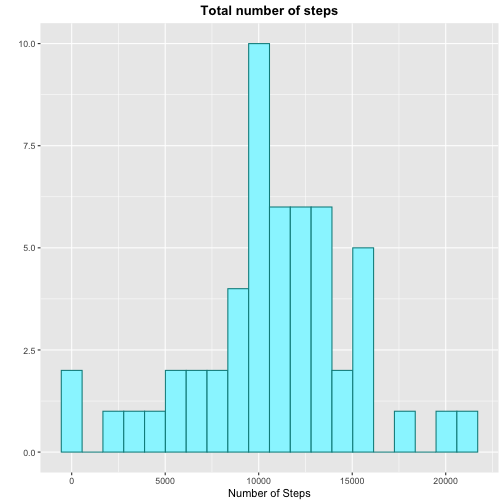
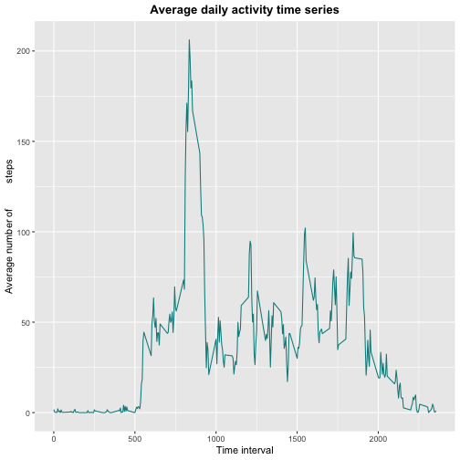
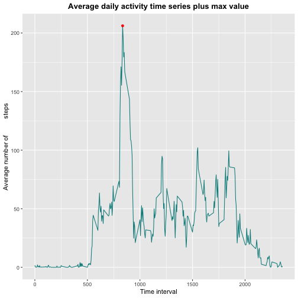
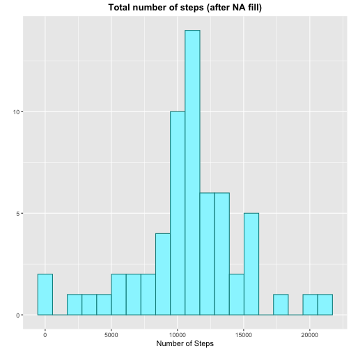
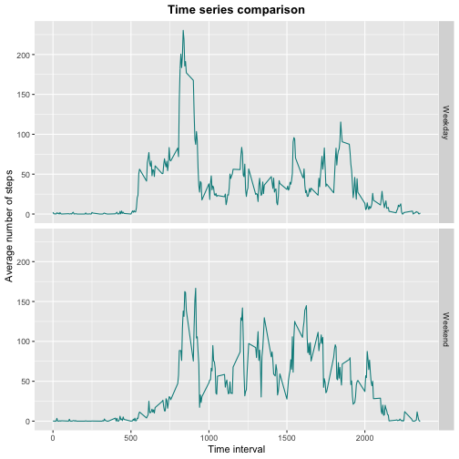

# Reproducible Research: Peer Assessment 1


## Loading data

```r
unzip('activity.zip')
data <- read.csv('activity.csv')

head(data)
```

```
##   steps       date interval
## 1    NA 2012-10-01        0
## 2    NA 2012-10-01        5
## 3    NA 2012-10-01       10
## 4    NA 2012-10-01       15
## 5    NA 2012-10-01       20
## 6    NA 2012-10-01       25
```


## What is mean total number of steps taken per day?
#### 1. Calculate the total number of steps taken per day

```r
data1 <- data %>% group_by(date) %>% summarise(Tot.steps = sum(steps))
```

#### 2. Make a histogram of the total number of steps taken each day

```r
p1 <- ggplot(data = data1, aes(x = Tot.steps)) + 
        geom_histogram(na.rm = TRUE, bins = 20, color = 'darkcyan', fill = 'cadetblue1') + 
        labs(title = 'Total number of steps', x = 'Number of Steps', y = '') + 
        theme(plot.title = element_text(hjust = 0.5, face = 'bold')) 
p1
```



#### 3. Calculate and report the mean and median of the total number of steps taken per day

```r
m <- mean(data1$Tot.steps, na.rm = TRUE)
md <- median(data1$Tot.steps, na.rm = TRUE)

statistics <- matrix(c(m, md), ncol = 2, dimnames = list('value', c('Mean', 'Median')))
print(statistics)
```

```
##           Mean Median
## value 10766.19  10765
```


## What is the average daily activity pattern?
#### 1. Make a time series plot of the 5-minute interval (x-axis) and the average number of steps taken, averaged across all days (y-axis)

```r
data2 <- data %>% group_by(interval) %>% summarise(avg = mean(steps, na.rm = TRUE))
```


```r
p2 <- ggplot(data = data2, aes(x = interval, y = avg)) + 
        geom_line(color = 'darkcyan') + 
        labs(title = 'Average daily activity time series', x = 'Time interval', y = 'Average number of         steps') + theme(plot.title = element_text(hjust = 0.5, face = 'bold')) 
p2
```



#### 2. Which 5-minute interval, on average across all the days in the dataset, contains the maximum number of steps?

```r
max_step = max(data2$avg)

max_int = data2[data2$avg == max_step, ]
print(max_int)
```

```
## # A tibble: 1 x 2
##   interval   avg
##      <int> <dbl>
## 1      835  206.
```


```r
p3 <- p2 + 
        geom_point(data = max_int, aes(x = interval, y = avg), color = 'red') + 
        labs(title = 'Average daily activity time series plus max value')
p3
```




## Imputing missing values
#### 1. Calculate and report the total number of missing values in the dataset

```r
number_NA <- length(data[is.na(data$steps), 'steps'])
print(number_NA)
```

```
## [1] 2304
```

#### 2. Devise a strategy for filling in all of the missing values in the dataset

```r
data3 <- data

data3$temp <- rep(data2$avg, (dim(data3)[1]/dim(data2)[1]))

data3$steps <- round(as.numeric(apply(data3, 1, function(x) ifelse(is.na(x[1]), x[4], x[1]))), 2)

data3 <- data3[, 1:3]
```

#### 3. Create a new dataset that is equal to the original dataset but with the missing data filled in

```r
data4 <- data3 %>% group_by(date) %>% summarise(Tot.steps = sum(steps))
```

#### 4. Make a histogram of the total number of steps taken each day and calculate and report 

```r
p3 <- ggplot(data = data4, aes(x = Tot.steps)) + 
        geom_histogram(na.rm = TRUE, bins = 20, color = 'darkcyan', fill = 'cadetblue1') + 
        labs(title = 'Total number of steps (after NA fill)', x = 'Number of Steps', y = '') + 
        theme(plot.title = element_text(hjust = 0.5, face = 'bold')) 
p3
```



Statistics comparison 

```r
m_new <- mean(data4$Tot.steps)
md_new <- median(data4$Tot.steps)

statistics_new <- matrix(c(m_new, md_new), ncol = 2, 
                         dimnames = list('value', c('Mean', 'Median')))

stat_comp <- rbind(statistics, statistics_new, round(statistics_new-statistics, 2))

rownames(stat_comp) <- c('value old', 'value new', 'difference')

print(stat_comp)
```

```
##                Mean   Median
## value old  10766.19 10765.00
## value new  10766.18 10766.13
## difference    -0.01     1.13
```


## Are there differences in activity patterns between weekdays and weekends?
#### 1. Create a new factor variable in the dataset with two levels – “weekday” and “weekend” indicating whether a given date is a weekday or weekend day

```r
data6 <- data3

data6$date <- as.Date(data6$date, format = '%Y-%m-%d')

data6$day <- as.factor(weekdays(data6$date))

levels(data6$day) <- list(Weekday = c('Monday', 'Tuesday', 'Wednesday', 'Thursday', 'Friday'), 
                              Weekend = c('Saturday', 'Sunday'))
```


```r
data7 <- data6 %>% group_by(interval, day) %>% summarise(avg = mean(steps))
```

#### 2. Make a panel plot containing a time series plot of the 5-minute interval (x-axis) and the average number of steps taken, averaged across all weekday days or weekend days (y-axis)

```r
p7 <- ggplot(data = data7, aes(x = interval, y = avg)) + 
        geom_line(color = 'darkcyan') +   facet_grid(day ~ .) + 
        labs(title = 'Time series comparison', x = 'Time interval', y = 'Average number of steps') + 
        theme(plot.title = element_text(hjust = 0.5, face = 'bold')) 
p7
```


